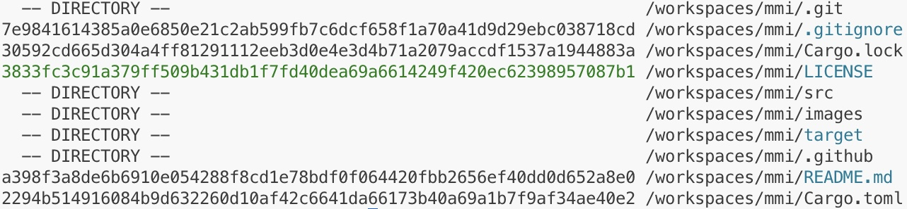

# mmi

Metadata is the lowest-value indicator as easy to circumvent. Still, with the exponential volume of directories and files standard on default operating system installations, finding things hiding in plain sight has become an important analysis technique.

```
mmi
```

Output:



### Visualizations

- **BLUE** Known Meta Text
- **GREEN** Known File Content
- **RED** Suspect Living Off Land

### Classifications

- **DENIED** Permission Issue (RED)
- **DIRECTORY** Folder Path
- **EMPTY** Empty File Hash
- **ERROR** Content Hash Error (RED)
- **LARGE** File Size 1+ GB (RED)
- **ZERO** Zero File Size

### Help Command

```
mmi help
```

Output:

```
Commands: download, status, verify
```

### Required Files

```
mmi
```

Output:

```
Required File: /workspaces/mmi/target/debug/lol.poppy
Required File: /workspaces/mmi/target/debug/mmi.poppy
Download Link: https://github.com/jblukach/artifacts/releases
```

### Download Command

```
mmi download
```

Output:

```
Download Link: https://github.com/jblukach/artifacts/releases/download/v2025.02.02/lol.poppy
File Download: /workspaces/mmi/target/debug/lol.poppy
Download Link: https://github.com/jblukach/artifacts/releases/download/v2025.02.02/mmi.poppy
File Download: /workspaces/mmi/target/debug/mmi.poppy
Download Link: https://github.com/jblukach/artifacts/releases/download/v2025.02.02/verification.csv
File Download: /workspaces/mmi/target/debug/verification.csv
```

### Status Command

```
mmi status
```

Output:

```
Estimate: 22116 /workspaces/mmi/target/debug/lol.poppy
Estimate: 4071377 /workspaces/mmi/target/debug/mmi.poppy
```

### Verify Command

```
mmi verify
```

Output:

```
Verified: /workspaces/mmi/target/debug/mmi.poppy
Verified: /workspaces/mmi/target/debug/lol.poppy
```

### Requirement

```
curl https://sh.rustup.rs -sSf | sh -s -- -y
source "$HOME/.cargo/env"
```

### Installation

```
cargo install mmi
```


