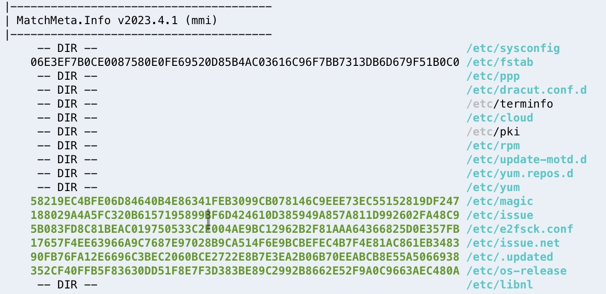

# mmi

Amazon Linux default installation now starts with about 175k+ directories and files. How do we know which files belong on a particular host during the triage of the operating system?

Review enough systems; you start remembering all those Amazon Linux operating system artifacts, just in time for new directories and filenames to end up in the mix or moved to other locations.

The ```mmi``` command line tool lists the current path’s directories and files based on the user access, which are color-coded to help reduce triage time.



### Installation

```
pip install matchmeta
```

### Command Line

```
mmi
```

### Color Coded

- :purple_square: Empty File (purple)
- :green_square: Known File (green)
- :blue_square: Known Meta (blue)
- :red_square: Large File (red)
- :white_large_square: Partial Meta (grey)
- :black_large_square: Unknown (black)
- :yellow_square: Not Available (yellow)

### GTFOBins

- H for Known SHA256 Hash :red_square: (red)
- P for Known Full Path :red_square: (red)
- F for Known File Name :red_square: (red)

https://gtfobins.github.io

### Access Denied

- *** for Access Denied :red_square: (red)

### Local Development

```
pip install pybloomfiltermmap3
python setup.py install --user
```
